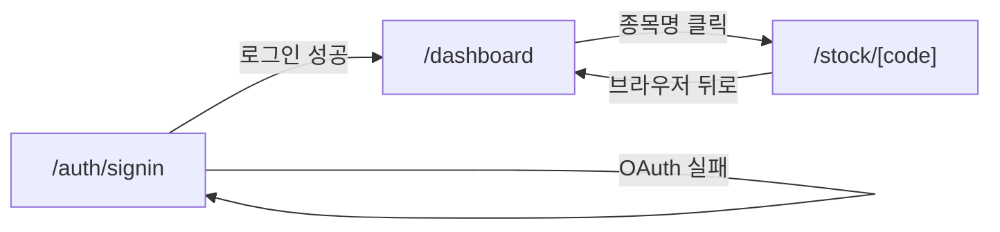

# 화면 정의서 (Screen Specification)

| 항목 | 내용 |
|:---|:---|
| 문서명 | 화면 정의서 |
| 버전 | v1.0 |
| 작성일 | 2026-06-07 |
| 프로젝트 | my-stock |

---

## 1. 개요

본 문서는 my-stock 시스템의 16개 화면(SCR-001~SCR-003-13)에 대한 컴포넌트 구조, 레이아웃, UX 이벤트를 명세한다. 화면 목록(screen-list.md)의 SCR 식별자와 1:1로 대응한다.

---

## 2. 공통 컴포넌트

| 컴포넌트 | 역할 | 사용 화면 |
|:---|:---|:---|
| `Skeleton` | 로딩 상태 플레이스홀더 | 모든 비동기 섹션 |
| `ErrorCard` | API 오류 표시 (메시지 + 재시도 버튼) | 모든 비동기 섹션 |
| `Badge` | 상태·태그 표시 칩 | SCR-002, SCR-003-01 |
| `Button` | 기본 액션 버튼 (shadcn/ui) | 전체 |
| `DataTable` | 정렬·필터 지원 테이블 (TanStack Table) | SCR-002, SCR-003-07, SCR-003-12 |
| `Pagination` | 페이지 이동 컨트롤 | SCR-002 TradeHistoryTable |
| `ThemeToggle` | 다크/라이트 모드 전환 (next-themes) | 전역 헤더 |
| `SessionExpiredPrompt` | 401 세션 만료 UI 알림 (리다이렉트 없음, SR-005) | 전역 |
| `Toast` | 성공·실패 알림 (shadcn/ui Toaster) | 전역 |
| `Spinner` | 인라인 로딩 아이콘 | 버튼·인라인 로딩 |

---

## 3. SCR-001 — 로그인 (`/auth/signin`)

### 3.1 레이아웃

```
┌─────────────────────────────────┐
│          ThemeToggle (우상단)    │
│                                 │
│    ┌───────────────────────┐    │
│    │      LoginCard         │    │
│    │  ┌─────────────────┐  │    │
│    │  │  서비스 로고/이름  │  │    │
│    │  └─────────────────┘  │    │
│    │  ┌─────────────────┐  │    │
│    │  │GoogleSignInButton│  │    │
│    │  └─────────────────┘  │    │
│    │  ┌─────────────────┐  │    │
│    │  │  ErrorMessage   │  │    │
│    │  └─────────────────┘  │    │
│    └───────────────────────┘    │
└─────────────────────────────────┘
```

- 중앙 정렬 카드 (`max-w-md`, `mx-auto`, `mt-24`)
- 다크/라이트 모드 지원

### 3.2 컴포넌트 명세

| 컴포넌트 | props | 설명 |
|:---|:---|:---|
| `LoginCard` | — | 로그인 카드 레이아웃 컨테이너 |
| `GoogleSignInButton` | `onClick`, `isLoading` | Google OAuth 로그인 버튼 |
| `ErrorMessage` | `message?: string` | 인증 실패 오류 메시지 (callbackUrl error param) |

### 3.3 이벤트

| 이벤트 | 처리 |
|:---|:---|
| GoogleSignInButton 클릭 | `signIn('google', { callbackUrl: '/dashboard' })` |
| OAuth 실패 | URL `?error=` 파라미터 → ErrorMessage 렌더링 |
| 로그인 성공 | NextAuth 세션 발급 → `/dashboard` 리다이렉트 |

---

## 4. SCR-002 — 대시보드 (`/dashboard`)

### 4.1 레이아웃

```
┌────────────────────────────────────────────────────┐
│  Header: 서비스명 + ThemeToggle + 로그아웃 버튼      │
├────────────────────────────────────────────────────┤
│  ┌──────┐ ┌──────┐ ┌──────┐ ┌──────┐             │
│  │KpiCard│ │KpiCard│ │KpiCard│ │KpiCard│  ← 4열 그리드│
│  └──────┘ └──────┘ └──────┘ └──────┘             │
├────────────────────────────────────────────────────┤
│  ┌─────────────────┐  ┌─────────────────┐         │
│  │PositionBarChart │  │ ProfitBarChart   │  ← 2열   │
│  └─────────────────┘  └─────────────────┘         │
├────────────────────────────────────────────────────┤
│  ┌────────────────────────────────────────────┐    │
│  │        CumulativeProfitChart (전폭)          │    │
│  └────────────────────────────────────────────┘    │
├────────────────────────────────────────────────────┤
│  ┌────────────────────────────────────────────┐    │
│  │          StockAnalysisTable                 │    │
│  └────────────────────────────────────────────┘    │
├────────────────────────────────────────────────────┤
│  ┌─────────────────┐  ┌─────────────────┐         │
│  │  StrategyTable   │  │ TradeHistoryTable│  ← 2열   │
│  └─────────────────┘  └─────────────────┘         │
└────────────────────────────────────────────────────┘
```

### 4.2 컴포넌트 명세

| 컴포넌트 | props / 데이터 | 설명 |
|:---|:---|:---|
| `KpiCard` | `label`, `value`, `unit`, `trend?` | KPI 요약 카드 (실현손익·평가손익·승률·총자산) |
| `PositionBarChart` | `data: PortfolioHolding[]` | Recharts BarChart — 보유 종목별 평가금액 비중 |
| `ProfitBarChart` | `data: TradeStats[]` | Recharts BarChart — 종목별 손익 기여도 |
| `CumulativeProfitChart` | `data`, `period: '6m' \| '1y'` | Recharts AreaChart — 누적 손익 추이 탭 전환 |
| `StockAnalysisTable` | `rows: TradeStats[]` | DataTable — 종목명 클릭 시 `/stock/[code]` 이동, 정렬·보유여부 필터 |
| `StrategyTable` | `data: TagStats[]` | 태그별 거래 성과 요약 |
| `TradeHistoryTable` | `rows: SheetTransactionRow[]` | 전체 매매 내역, Pagination 포함 |

### 4.3 이벤트

| 이벤트 | 처리 |
|:---|:---|
| 테이블 컬럼 헤더 클릭 | 정렬 토글 (asc/desc) |
| 보유 여부 토글 | StockAnalysisTable 필터 (보유중/전체) |
| 종목명 셀 클릭 | `router.push('/stock/[code]')` |
| CumulativeProfitChart 탭 전환 | 기간 필터 변경 (6m / 1y) |
| Pagination 이동 | TradeHistoryTable 페이지 변경 |

---

## 5. SCR-003 — 종목 상세 (`/stock/[code]`)

### 5.1 레이아웃

```
┌──────────────────────────────────────────────────────────┐
│  Header: 종목명 + 현재가 + 등락률 + ThemeToggle            │
├──────────────────────────────────┬───────────────────────┤
│  섹션 콘텐츠 (메인 영역, 80%)     │  앵커 메뉴 (우측, 20%) │
│  ┌────────────────────────────┐  │  ┌───────────────────┐│
│  │ 01. 시세 요약               │  │  │ 01 시세 요약       ││
│  │ 02. 가치평가                │  │  │ 02 가치평가        ││
│  │ 03. 재무 요약               │  │  │ 03 재무 요약       ││
│  │ 04. 레이더 차트              │  │  │ ...               ││
│  │ 05. 추정실적                │  │  │ 13 데이터 갱신     ││
│  │ 06. 매매동향                │  │  └───────────────────┘│
│  │ 07. 투자의견                │  │                       │
│  │ 08. DART 공시               │  │                       │
│  │ 09. 내 포트폴리오            │  │                       │
│  │ 10. 보조지표                │  │                       │
│  │ 11. AI 분석                 │  │                       │
│  │ 12. 매매 일지               │  │                       │
│  │ 13. 데이터 갱신              │  │                       │
│  └────────────────────────────┘  │                       │
└──────────────────────────────────┴───────────────────────┘
```

각 섹션은 `<section id="sec-NN">` 태그로 감싸며, 앵커 메뉴 클릭 시 smooth scroll.

---

## 6. SCR-003-01 — 시세 요약

### 6.1 컴포넌트

| 컴포넌트 | props | 설명 |
|:---|:---|:---|
| `PriceCard` | `data: StockPrice` | 현재가·전일비·등락률·52주 고저·시가총액·거래량 |
| `ChangeBadge` | `value: number` | 등락률 색상 배지 (양수=red, 음수=blue, 한국 관례) |

### 6.2 데이터 소스
`GET /api/kis/price?code={code}` → `StockPrice`

---

## 7. SCR-003-02 — 가치평가

### 7.1 컴포넌트

| 컴포넌트 | props | 설명 |
|:---|:---|:---|
| `ValuationTable` | `data: Valuation` | PER·PBR·EPS·BPS·ROE·ROA·부채비율 2열 그리드 |

### 7.2 데이터 소스
`GET /api/kis/valuation?code={code}` → `Valuation`

---

## 8. SCR-003-03 — 재무 요약

### 8.1 컴포넌트

| 컴포넌트 | props | 설명 |
|:---|:---|:---|
| `FinancialTable` | `data: FinancialSummary` | 자산·부채·자본·매출·영업익·순이익 2열 그리드 |

### 8.2 데이터 소스
`GET /api/kis/financial?code={code}` → `FinancialSummary`

---

## 9. SCR-003-04 — 레이더 차트

### 9.1 컴포넌트

| 컴포넌트 | props | 설명 |
|:---|:---|:---|
| `FinancialRadarChart` | `data: Valuation & FinancialSummary` | Recharts RadarChart — 수익성·안정성·성장성·배당·모멘텀 5축 |

### 9.2 축 정의

| 축 | 지표 |
|:---|:---|
| 수익성 | ROE 기반 점수 |
| 안정성 | 부채비율 역산 점수 |
| 성장성 | 영업이익 YoY 기반 |
| 가치 | PBR 역산 점수 |
| 모멘텀 | 현재가/52주 고점 비율 |

---

## 10. SCR-003-05 — 추정실적

### 10.1 컴포넌트

| 컴포넌트 | props | 설명 |
|:---|:---|:---|
| `EstimateTable` | `data: Valuation` | 컨센서스 추정 매출·영업익·순이익 (현재연도/차기연도) |

---

## 11. SCR-003-06 — 매매동향

### 11.1 컴포넌트

| 컴포넌트 | props | 설명 |
|:---|:---|:---|
| `CandlestickChart` | `data: DailyPrice[]` | 30일 캔들스틱 (Recharts ComposedChart + Bar) |
| `VolumeBarChart` | `data: DailyPrice[]` | 거래량 막대 (캔들 하단) |
| `InvestorTrendChart` | `data: TradingTrend[]` | 투자자별 순매수 (개인·외국인·기관) 누적 Bar |

### 11.2 데이터 소스
`GET /api/kis/daily-price?code={code}` → `DailyPrice[]`
`GET /api/kis/trading-trend?code={code}` → `TradingTrend[]`

---

## 12. SCR-003-07 — 투자의견

### 12.1 컴포넌트

| 컴포넌트 | props | 설명 |
|:---|:---|:---|
| `OpinionTable` | `data: AnalystOpinion[]` | DataTable — 증권사·투자의견·목표가·날짜 |

### 12.2 데이터 소스
`GET /api/kis/opinion?code={code}` → `AnalystOpinion[]`

---

## 13. SCR-003-08 — DART 공시

### 13.1 컴포넌트

| 컴포넌트 | props | 설명 |
|:---|:---|:---|
| `DartFinancialChart` | `data: DartFinancial` | Recharts LineChart — 5개년 매출·영업익·순이익 추이 |
| `DisclosureList` | `items: DartDisclosure[]` | 잠정실적 공시 목록 (원문 링크 포함) |

### 13.2 데이터 소스
`GET /api/dart/financial?code={code}` → `DartFinancial`

---

## 14. SCR-003-09 — 내 포트폴리오

### 14.1 컴포넌트

| 컴포넌트 | props | 설명 |
|:---|:---|:---|
| `PortfolioCard` | `data: PortfolioHolding` | 보유수량·평균단가·평가금액·수익률·실현손익 |

### 14.2 데이터 소스
`GET /api/sheets/aggregation` → `AggregationRow` (해당 종목 필터)

---

## 15. SCR-003-10 — 보조지표

### 15.1 컴포넌트

| 컴포넌트 | props | 설명 |
|:---|:---|:---|
| `RsiCard` | `indicators: TechnicalIndicators` | RSI(14) 값 + 과매수/과매도 해석 Badge |
| `MacdCard` | `indicators: TechnicalIndicators` | MACD·Signal·Histogram 값 + 추세 해석 Badge |

### 15.2 계산 방식
클라이언트 사이드에서 `DailyPrice[]`의 `close` 배열로 RSI(14), MACD(12,26,9) 직접 계산 (FR-019, CLAUDE.md).

---

## 16. SCR-003-11 — AI 분석

### 16.1 컴포넌트

| 컴포넌트 | props | 설명 |
|:---|:---|:---|
| `AiAnalysisCard` | `data: AiAnalysisResult` | gpt-4o-mini 분석 텍스트 + 생성일시 |
| `RefreshButton` | `onClick`, `isLoading` | AI 분석 강제 갱신 (POST /api/ai/analysis) |

### 16.2 데이터 소스
`GET /api/ai/analysis?code={code}` → `AiAnalysisResult` (7일 캐시)
`POST /api/ai/analysis` `{code}` → 강제 갱신

---

## 17. SCR-003-12 — 매매 일지

### 17.1 컴포넌트

| 컴포넌트 | props | 설명 |
|:---|:---|:---|
| `JournalTable` | `rows: SheetTransactionRow[]` | 해당 종목 매매 내역 (날짜·유형·수량·단가·메모·태그) |

### 17.2 데이터 소스
`GET /api/sheets/transactions` → `SheetTransactionRow[]` (code 필터)

---

## 18. SCR-003-13 — 데이터 갱신

### 18.1 컴포넌트

| 컴포넌트 | props | 설명 |
|:---|:---|:---|
| `RefreshAllButton` | `onClick`, `isLoading` | POST /api/ticker/[code]/refresh 호출 |
| `ProgressIndicator` | `sections`, `completedSections` | 갱신 진행 현황 표시 (섹션별 체크리스트) |

### 18.2 동작

1. 버튼 클릭 → `POST /api/ticker/[code]/refresh` (최대 60초)
2. ProgressIndicator에 갱신 중 섹션 표시
3. 완료 후 마지막 갱신 시각 갱신 + Toast 알림

---

## 19. 화면 흐름 다이어그램



---

## 20. 반응형 브레이크포인트

| 화면 | 브레이크포인트 | 변화 |
|:---|:---|:---|
| 대시보드 KPI | `md:` (768px) | 2열 → 4열 |
| 대시보드 차트 | `lg:` (1024px) | 1열 → 2열 |
| 종목상세 앵커 | `xl:` (1280px) | 앵커메뉴 숨김 → 표시 |
| 테이블 컬럼 | `sm:` (640px) | 핵심 컬럼만 표시 |
