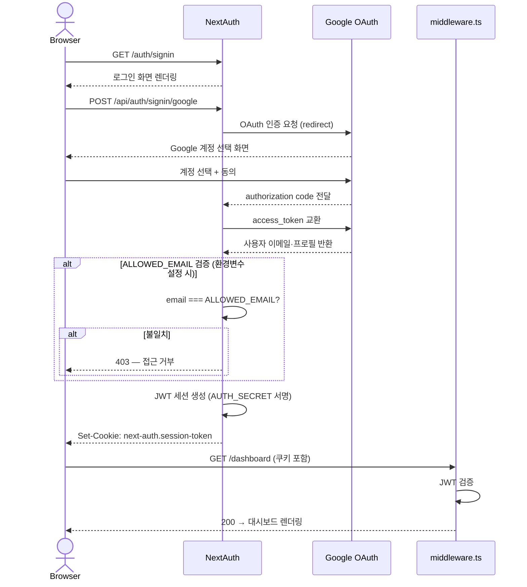
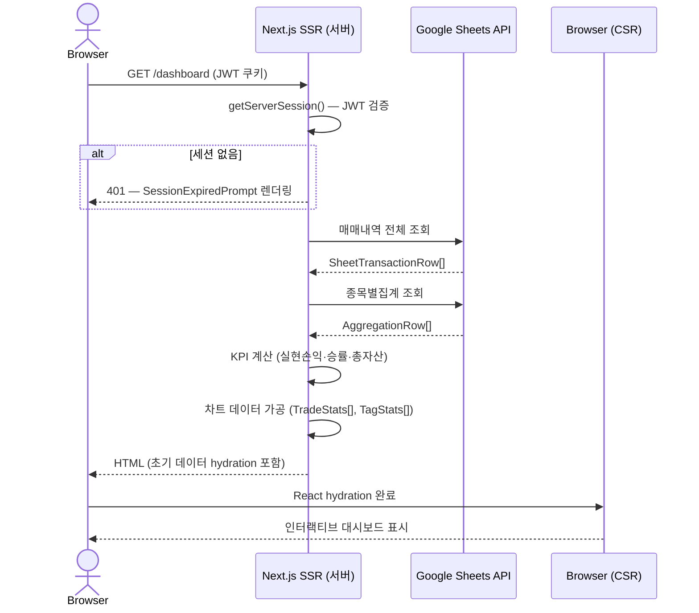
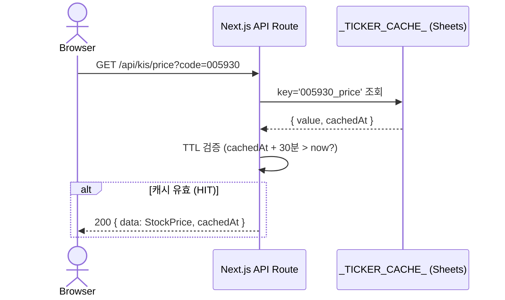
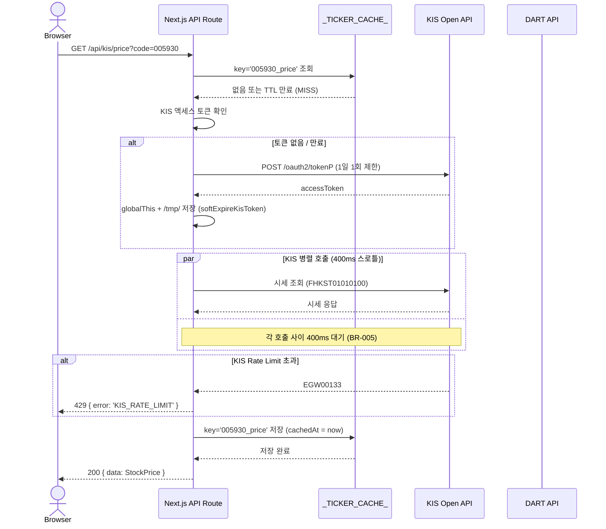
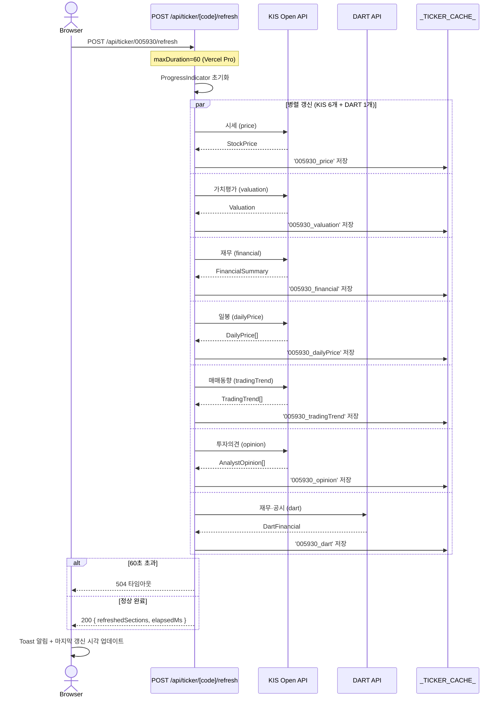
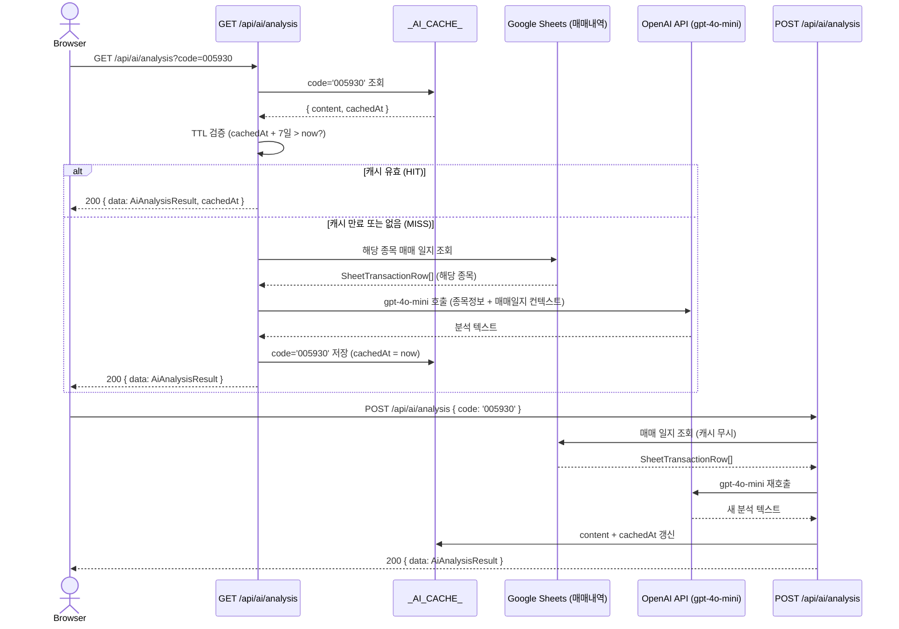
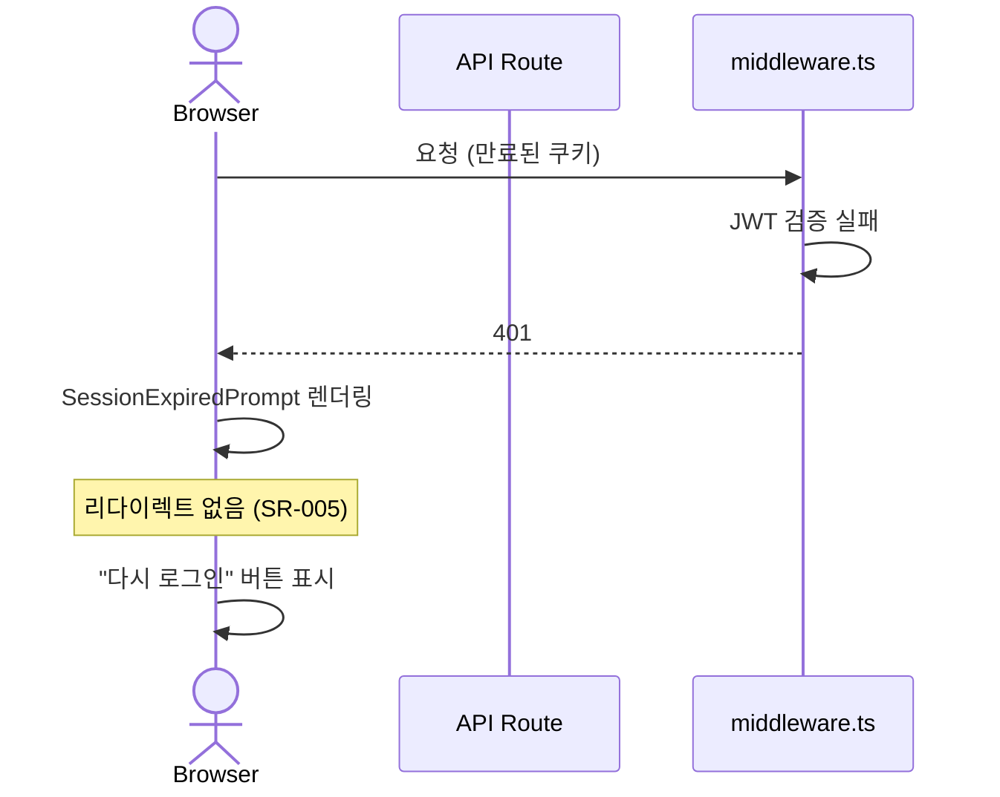

# 시퀀스 다이어그램 (Sequence Design)

| 항목 | 내용 |
|:---|:---|
| 문서명 | 시퀀스 다이어그램 |
| 버전 | v1.0 |
| 작성일 | 2026-06-07 |
| 프로젝트 | my-stock |

---

## 1. 개요

본 문서는 my-stock의 6개 핵심 시나리오에 대한 시퀀스 다이어그램을 정의한다. 각 시나리오는 캐시 HIT/MISS 분기, Rate Limit 처리, 인증 흐름을 포함한다.

| SEQ-ID | 시나리오 | 연계 UC |
|:---|:---|:---|
| SEQ-001 | Google 로그인 | UC-001 |
| SEQ-002 | 대시보드 초기 로딩 | UC-003~006 |
| SEQ-003 | 종목 상세 — 캐시 HIT | UC-007~011 |
| SEQ-004 | 종목 상세 — 캐시 MISS (KIS+DART 병렬) | UC-007~011 |
| SEQ-005 | 데이터 갱신 버튼 (60초 통합 갱신) | UC-015 |
| SEQ-006 | AI 분석 조회 및 강제 갱신 | UC-014 |

---

## 2. SEQ-001: Google 로그인

**연계 UC**: UC-001  
**참여자**: Browser, NextAuth, Google OAuth, middleware.ts

### 메시지 정의

| 순서 | 발신 | 수신 | 메시지 | 비고 |
|:---:|:---|:---|:---|:---|
| 1 | Browser | NextAuth | GET /auth/signin | 로그인 페이지 요청 |
| 2 | Browser | NextAuth | POST /api/auth/signin/google | 로그인 버튼 클릭 |
| 3 | NextAuth | Google OAuth | OAuth 인증 요청 | redirect_uri 포함 |
| 4 | Browser | Google OAuth | 계정 선택 | 사용자 직접 조작 |
| 5 | Google OAuth | NextAuth | authorization code | callback URL |
| 6 | NextAuth | NextAuth | ALLOWED_EMAIL 검증 | 환경변수 있을 때만 |
| 7 | NextAuth | Browser | JWT 쿠키 발급 | HttpOnly, Secure |

---

## 3. SEQ-002: 대시보드 초기 로딩

**연계 UC**: UC-003, UC-004, UC-005, UC-006  
**참여자**: Browser, Next.js SSR, Google Sheets API

### 메시지 정의

| 순서 | 발신 | 수신 | 메시지 | 비고 |
|:---:|:---|:---|:---|:---|
| 1 | Browser | SSR | GET /dashboard | 쿠키 포함 |
| 2 | SSR | Sheets | 매매내역 조회 | 전체 데이터 |
| 3 | SSR | Sheets | 종목별집계 조회 | optional 탭 |
| 4 | SSR | SSR | KPI·차트 데이터 계산 | 서버 사이드 |
| 5 | SSR | Browser | HTML + JSON | 초기 상태 포함 |

---

## 4. SEQ-003: 종목 상세 — 캐시 HIT

**연계 UC**: UC-007, UC-008, UC-009, UC-010, UC-011  
**참여자**: Browser, API Route, _TICKER_CACHE_ (Sheets)

### 메시지 정의

| 순서 | 발신 | 수신 | 메시지 | 비고 |
|:---:|:---|:---|:---|:---|
| 1 | Browser | API | GET /api/kis/price?code= | JWT 쿠키 |
| 2 | API | Cache | key 조회 | Sheets API |
| 3 | API | API | TTL 30분 검증 | |
| 4 | API | Browser | 200 + cachedAt | 캐시 HIT |

---

## 5. SEQ-004: 종목 상세 — 캐시 MISS (KIS+DART 병렬 호출)

**연계 UC**: UC-007, UC-008, UC-009, UC-010, UC-011  
**참여자**: Browser, API Route, _TICKER_CACHE_, KIS API, DART API

### 메시지 정의

| 순서 | 발신 | 수신 | 메시지 | 비고 |
|:---:|:---|:---|:---|:---|
| 1 | Browser | API | GET /api/kis/price?code= | |
| 2 | API | Cache | key 조회 | MISS 또는 만료 |
| 3 | API | KIS | 토큰 발급 (조건부) | 1일 1회 |
| 4 | API | KIS | 시세 조회 | 400ms 스로틀 |
| 5 | API | Cache | 결과 저장 | cachedAt = now |
| 6 | API | Browser | 200 | 최신 데이터 |

---

## 6. SEQ-005: 데이터 갱신 버튼 (60초 통합 갱신)

**연계 UC**: UC-015  
**참여자**: Browser, /refresh API, KIS API (×6), DART API, _TICKER_CACHE_

### 메시지 정의

| 순서 | 발신 | 수신 | 메시지 | 비고 |
|:---:|:---|:---|:---|:---|
| 1 | Browser | RefreshAPI | POST /api/ticker/[code]/refresh | |
| 2~8 | RefreshAPI | KIS/DART | 7개 섹션 병렬 조회 | 400ms 스로틀 내 |
| 9 | RefreshAPI | Cache | 각 섹션 결과 저장 | cachedAt 갱신 |
| 10 | RefreshAPI | Browser | 200 완료 / 504 타임아웃 | |

---

## 7. SEQ-006: AI 분석 조회 및 강제 갱신

**연계 UC**: UC-014  
**참여자**: Browser, AI API Route, _AI_CACHE_, OpenAI API, Google Sheets (매매내역)

### 메시지 정의

| 순서 | 발신 | 수신 | 메시지 | 비고 |
|:---:|:---|:---|:---|:---|
| 1 | Browser | AIAPI | GET /api/ai/analysis?code= | |
| 2 | AIAPI | AICache | code 조회 | |
| 3a | AIAPI | Browser | 200 + cachedAt | 캐시 HIT |
| 3b | AIAPI | Sheets | 매매 일지 조회 | 캐시 MISS |
| 4 | AIAPI | OpenAI | gpt-4o-mini 호출 | FR-020 |
| 5 | AIAPI | AICache | 결과 저장 | 7일 TTL |
| 6 | Browser | ForceAPI | POST (강제 갱신) | RefreshButton |

---

## 8. 공통 오류 처리 시퀀스

