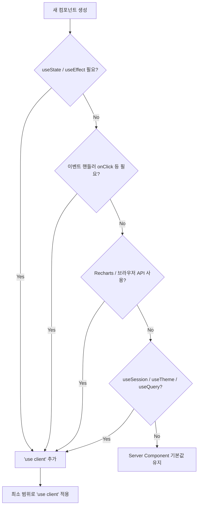

# Next.js Server Component 사용 기준 가이드

| 항목 | 내용 |
|:---|:---|
| 문서명 | Server Component 사용 기준 가이드 |
| 버전 | v1.0 |
| 작성일 | 2026-06-07 |
| 프로젝트 | my-stock |

---

## 1. 개요

Next.js 15 App Router에서 모든 컴포넌트는 기본적으로 **Server Component(RSC)**다. `'use client'` 지시어가 있는 컴포넌트만 클라이언트 번들에 포함된다. my-stock의 올바른 서버/클라이언트 컴포넌트 분리 기준을 정의한다.

---

## 2. 서버/클라이언트 컴포넌트 판단 기준

| 기준 | Server Component | Client Component (`'use client'`) |
|:---|:---:|:---:|
| `'use client'` 지시어 | 불필요 | **필수** |
| 직접 DB/API 호출 (서버사이드) | ✅ | ❌ (API Route 경유) |
| `useState`, `useEffect` 훅 | ❌ | ✅ |
| `onClick`, `onChange` 이벤트 핸들러 | ❌ | ✅ |
| `useSession()`, `useTheme()` | ❌ | ✅ |
| `useQuery()`, `useMutation()` | ❌ | ✅ |
| Recharts 컴포넌트 | ❌ | ✅ (window 객체 사용) |
| `IntersectionObserver` | ❌ | ✅ |
| 서버 전용 환경변수 직접 접근 | ✅ | ❌ |
| `async/await` 컴포넌트 함수 | ✅ | ❌ |

---

## 3. my-stock 컴포넌트 분류 목록

### 3.1 Server Components (기본값)

| 컴포넌트/파일 | 이유 |
|:---|:---|
| `app/layout.tsx` | ThemeProvider 래핑 (Provider 자체는 client) |
| `app/page.tsx` → `/dashboard` | 서버사이드 초기 데이터 fetch |
| `app/dashboard/page.tsx` | Sheets 매매내역 SSR 프리페치 |
| `app/stock/[code]/page.tsx` | params 추출 후 client 컴포넌트에 전달 |
| `app/api/**/route.ts` | Route Handler는 항상 서버 |
| `middleware.ts` | Edge Runtime (서버) |
| `components/dashboard/kpi-grid.tsx` | 서버에서 계산된 KPI 데이터 렌더링 |

### 3.2 Client Components (`'use client'`)

| 컴포넌트 | 이유 |
|:---|:---|
| `components/ui/theme-toggle.tsx` | `useTheme()` 사용 |
| `components/global/session-expired-prompt.tsx` | `useSession()`, fetch 인터셉터 |
| `components/dashboard/stock-analysis-table.tsx` | `useState` (정렬·필터) |
| `components/dashboard/trade-history-table.tsx` | `useState` (페이지네이션) |
| `components/dashboard/cumulative-profit-chart.tsx` | Recharts, 탭 `useState` |
| `components/stock/price-card.tsx` | `useStockPrice()` hook |
| `components/stock/candlestick-chart.tsx` | Recharts `ComposedChart` |
| `components/stock/financial-radar-chart.tsx` | Recharts `RadarChart` |
| `components/stock/dart-financial-chart.tsx` | Recharts `LineChart` |
| `components/stock/ai-analysis-card.tsx` | `useMutation` (강제갱신) |
| `components/stock/refresh-all-button.tsx` | `useMutation`, `useState` |
| `components/stock/anchor-menu.tsx` | `IntersectionObserver`, `useState` |
| `app/auth/signin/page.tsx` | `useSearchParams()`, `signIn()` |
| `app/providers.tsx` | `QueryClientProvider` (훅 컨텍스트) |

---

## 4. 데이터 패싱 패턴 (Server → Client)

### 4.1 기본 패턴: 서버 fetch → 클라이언트 props

```typescript
// Server Component (page.tsx)
export default async function StockDetailPage({ params }: { params: { code: string } }) {
  const code = params.code

  // 서버에서 직접 Sheets 조회 (캐시 활용)
  const initialTransactions = await getTransactionsFromSheets()

  // 클라이언트 컴포넌트에 초기 데이터 전달
  return (
    <StockDetailClient
      code={code}
      initialTransactions={initialTransactions}
    />
  )
}
```

### 4.2 TanStack Query Hydration 패턴

```typescript
// Server Component (page.tsx)
import { dehydrate, HydrationBoundary, QueryClient } from '@tanstack/react-query'

export default async function StockDetailPage({ params }) {
  const queryClient = new QueryClient()

  await queryClient.prefetchQuery({
    queryKey: ['kis', 'price', params.code],
    queryFn: () => fetchKisPrice(params.code),  // 서버 직접 호출
    staleTime: 30 * 60 * 1000,
  })

  return (
    <HydrationBoundary state={dehydrate(queryClient)}>
      <StockDetailClient code={params.code} />
    </HydrationBoundary>
  )
}

// Client Component (stock-detail-client.tsx)
'use client'
import { useQuery } from '@tanstack/react-query'

function StockDetailClient({ code }: { code: string }) {
  const { data } = useQuery({
    queryKey: ['kis', 'price', code],
    queryFn: () => fetch(`/api/kis/price?code=${code}`).then(r => r.json()),
    staleTime: 30 * 60 * 1000,
    // HydrationBoundary가 prefetch 데이터로 초기화 — 추가 네트워크 요청 없음
  })

  return <PriceCard data={data?.data} />
}
```

---

## 5. 주의사항 및 안티패턴

### 5.1 서버 API 키를 클라이언트에 노출 금지

```typescript
// ❌ 잘못된 예: Client Component에서 환경변수 직접 접근
'use client'
function BadComponent() {
  const apiKey = process.env.KIS_APP_KEY  // 빌드 시 undefined (NEXT_PUBLIC_ 없으면)
  // 또는 NEXT_PUBLIC_KIS_APP_KEY 로 선언하면 클라이언트에 노출됨 — 보안 위험
}

// ✅ 올바른 예: API Route Handler 경유
'use client'
function GoodComponent() {
  const { data } = useQuery({
    queryKey: ['kis', 'price', code],
    queryFn: () => fetch('/api/kis/price?code=' + code).then(r => r.json()),
    // API Route가 서버에서 KIS_APP_KEY 사용 — 클라이언트에 노출 안 됨
  })
}
```

### 5.2 Recharts는 반드시 Client Component

```typescript
// ❌ 잘못된 예: Server Component에서 Recharts 사용
// Recharts는 내부적으로 window, document 접근 → 서버에서 에러 발생
export default function Chart() {  // 'use client' 없음 → Server Component
  return <BarChart data={data} />  // 오류!
}

// ✅ 올바른 예
'use client'  // 반드시 추가
export default function Chart() {
  return <BarChart data={data} />
}
```

### 5.3 Client Component 경계 최소화

```typescript
// ❌ 잘못된 예: 전체 페이지를 Client Component로 만들기
'use client'
export default function StockDetailPage({ params }) {  // 전체가 클라이언트 번들로
  const code = params.code
  // ...
}

// ✅ 올바른 예: 페이지는 Server, 인터랙티브 부분만 Client
// page.tsx (Server)
export default async function StockDetailPage({ params }) {
  return <PriceSection code={params.code} />  // 작은 Client 컴포넌트
}

// price-section.tsx (Client)
'use client'
export function PriceSection({ code }: { code: string }) {
  const { data } = useStockPrice(code)
  return <PriceCard data={data?.data} />
}
```

### 5.4 `'use client'` 경계 전파 이해

```
app/page.tsx (Server)           ← async, 서버 데이터 fetch
  └─ providers.tsx (Client)     ← 'use client' — QueryClientProvider
       └─ dashboard.tsx (?)     ← providers 자식이어도 Server 가능
            └─ chart.tsx (Client) ← 'use client' 직접 선언 필요
```

> `'use client'` 경계 아래의 모든 컴포넌트가 자동으로 클라이언트가 되지는 않는다. 클라이언트 기능이 필요한 각 컴포넌트에 직접 `'use client'`를 선언한다.

---

## 6. Route Handler는 항상 서버

```typescript
// src/app/api/kis/price/route.ts
// Route Handler는 'use client' 없이도 항상 서버에서 실행됨
import { getServerSession } from 'next-auth'
import { authOptions } from '@/lib/auth'
import { env } from '@/lib/env'  // 서버 전용 env 접근 가능

export async function GET(request: Request) {
  // 항상 서버 컨텍스트
}

// maxDuration 설정도 Route Handler에서만 가능
export const maxDuration = 60  // /api/ticker/[code]/refresh에만 적용
```

---

## 7. 서버/클라이언트 컴포넌트 결정 플로우차트


